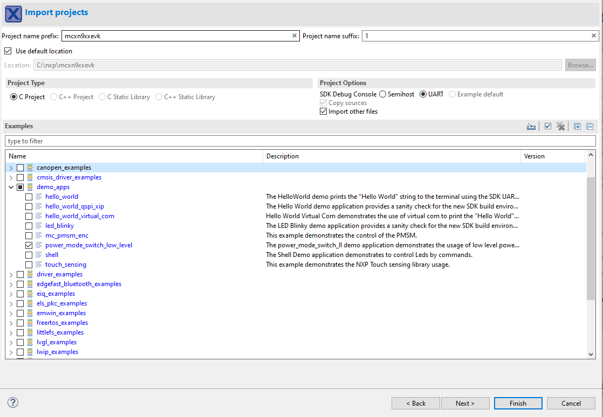
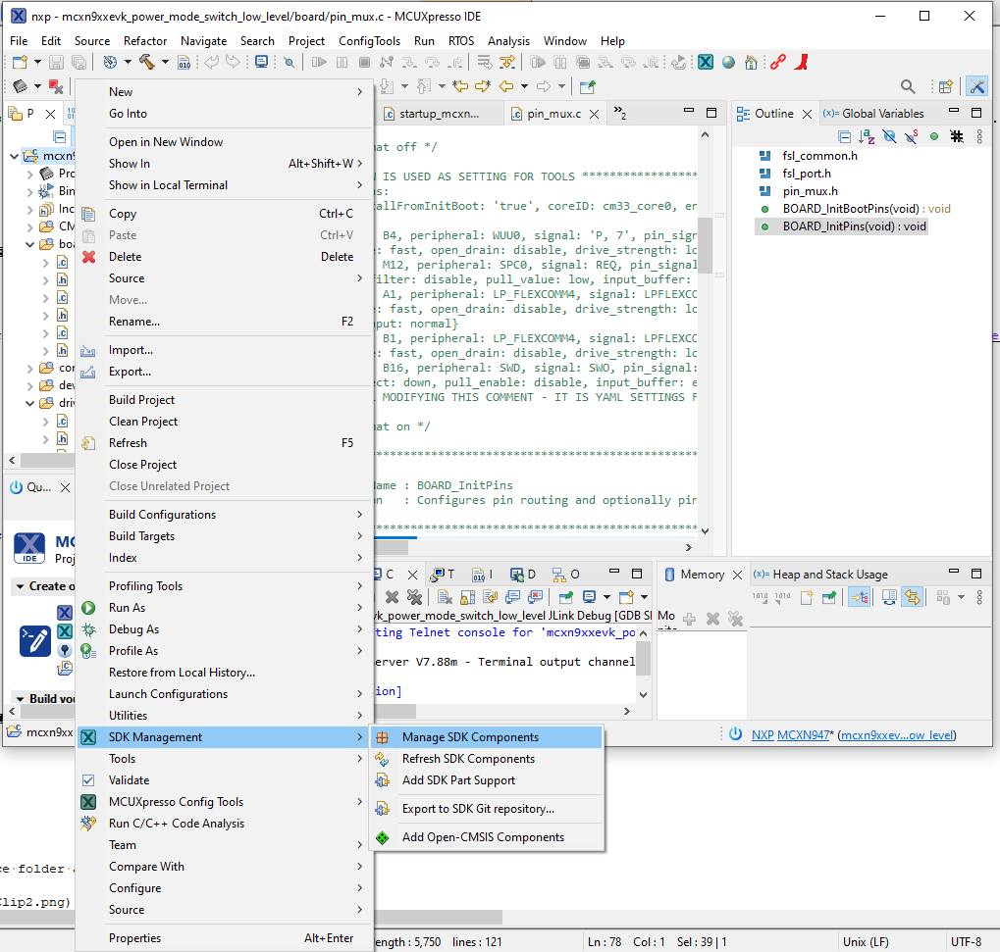
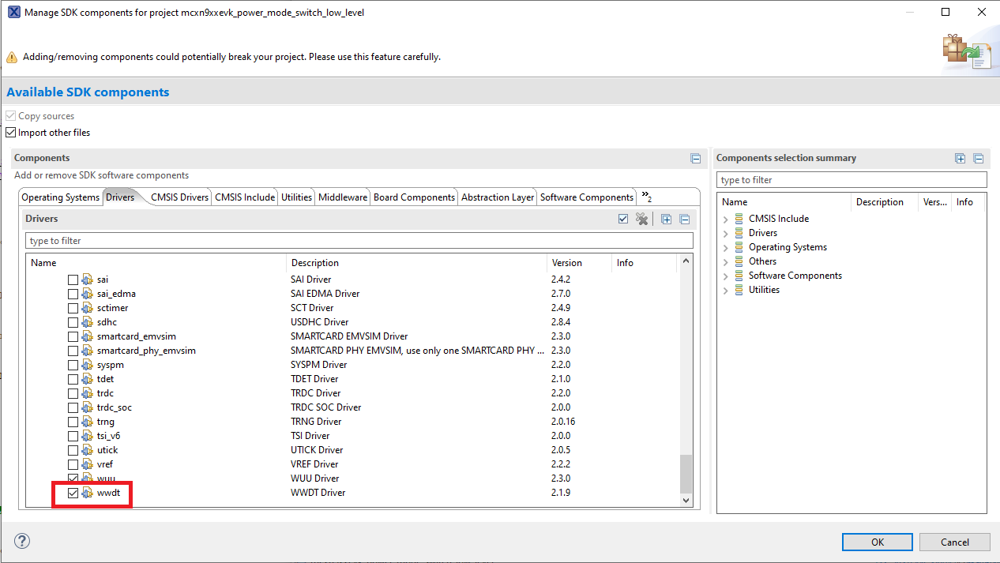
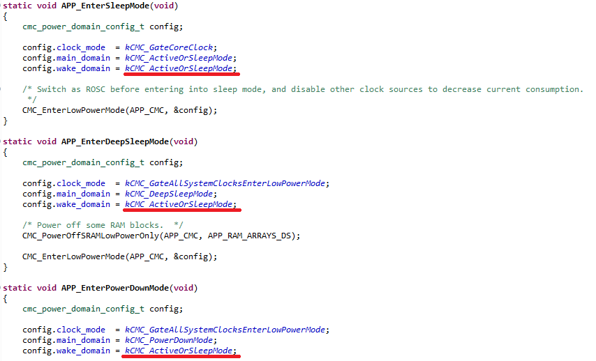
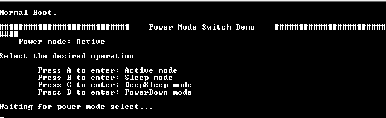
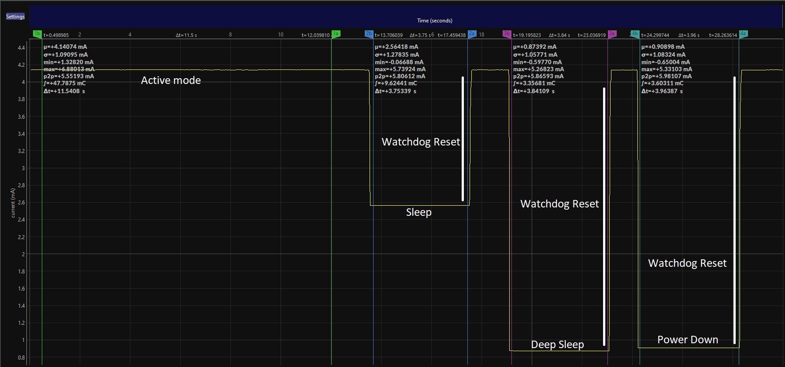

# NXP Application Code Hub
[](https://www.nxp.com)

## MCXN - how to enable the windowed watchdog on low power


Create package software about how to enable watchdog in low power examples.


#### Boards: FRDM-MCXN947
#### Categories: Low Power
#### Peripherals: WATCHDOG
#### Toolchains: MCUXpresso IDE

## Table of Contents
1. [Software](#step1)
2. [Hardware](#step2)
3. [Setup](#step3)
4. [Results](#step4)
5. [FAQs](#step5) 
6. [Support](#step6)
7. [Release Notes](#step7)

## 1. Software<a name="step1"></a>
This code has been implemented using MCUXpresso IDE version 11.8.0 and SDK verison 2.14.0 was used.

## 2. Hardware<a name="step2"></a>
- Purchase supported board:
    - [FRDM-MCXN947](https://www.nxp.com/part/FRDM-MCXN947#/)

## 3. Setup<a name="step3"></a>

### 3.1 Step 1
Import the project *"power_mode_switch_low_level"* into MCUXpresso IDE by following the following sections of the "MCUXpresso IDE - User Guide" found in the documentation section of the [MCUXpresso IDE page](https://www.nxp.com/design/software/development-software/mcuxpresso-software-and-tools-/mcuxpresso-integrated-development-environment-ide:MCUXpresso-IDE):





### 3.2 Step 2
You need to be aware that the demo that we used does not contain the Watchdog driver files by default, it is necessary to add it into the project. Add windowed watchdog drivers using MCUXpresso, right click into the project foldar, search for *"SDK Management"* and select *"manage components"*, *" Drivers"* and then select *"wwdt"* as shown below: 





### 3.3 Step 3

Once you have included the Watchdog drivers files in your custom project, the next step is to add the right configurations in order to enable the Watchdog in low power modes, The following sections explain the main aspects that you should focus on:

#### - power_mode_switch.c file
in this file is needed to add the declarations, variables and includes in order to configurate the Watchdog:

#### Include:
```C
#include "fsl_wwdt.h"
#include <stdbool.h>
```

#### Declarations and variables:

```C
#define WWDT                WWDT0
#define APP_WDT_IRQn        WWDT0_IRQn
#define APP_WDT_IRQ_HANDLER WWDT0_IRQHandler
#define WDT_CLK_FREQ        CLOCK_GetWdtClkFreq(0)
#define IS_WWDT_RESET       (0 != (CMC0->SRS & CMC_SRS_WWDT0_MASK))
```

Neccesary functions:

Also is neccesary to declarate and create the function to configurate the Watchdog timer and the interruption if is needed in the application to call the Watchdog :

```C
 void APP_WDT_IRQ_HANDLER(void);
 void delayWwdtWindow(void);

 void init_Wwd(void);
 wwdt_config_t config;
```


```C
  void APP_WDT_IRQ_HANDLER(void)
{
    uint32_t wdtStatus = WWDT_GetStatusFlags(WWDT);

    /* The chip will reset before this happens */
    if (wdtStatus & kWWDT_TimeoutFlag)
    {
        WWDT_ClearStatusFlags(WWDT, kWWDT_TimeoutFlag);
    }

    /* Handle warning interrupt */
    if (wdtStatus & kWWDT_WarningFlag)
    {
        /* A watchdog feed didn't occur prior to warning timeout */
        WWDT_ClearStatusFlags(WWDT, kWWDT_WarningFlag);
        /* User code. User can do urgent case before timeout reset.
         * IE. user can backup the ram data or ram log to flash.
         * the period is set by config.warningValue, user need to
         * check the period between warning interrupt and timeout.
         */
    }

#if (defined(LPC55S36_WORKAROUND) && LPC55S36_WORKAROUND)
    /* Set PMC register value that could run with GDET enable */
    PMC->LDOPMU   = 0x0109CF18;
    PMC->DCDC0    = 0x010A767E;
    PMC->LDOCORE0 = 0x2801006B;
#endif
    SDK_ISR_EXIT_BARRIER;
}
```

```C
void delayWwdtWindow(void)
{
    /* For the TV counter register value will decrease after feed watch dog,
     * we can use it to as delay. But in user scene, user need feed watch dog
     * in the time period after enter Window but before warning intterupt.
     */
    while (WWDT->TV > WWDT->WINDOW)
    {
        __NOP();
    }
}
```

```C
 void init_Wwd(void)
 {
    uint32_t wdtFreq;
    bool timeOutResetEnable;

    /* Enable the WWDT time out to reset the CPU. */
    timeOutResetEnable = true;

    /* Check if reset is due to Watchdog */
#ifdef IS_WWDT_RESET
    if (IS_WWDT_RESET)
#else
    if (WWDT_GetStatusFlags(WWDT) & kWWDT_TimeoutFlag)
#endif
    {
        PRINTF("Watchdog reset occurred\r\n");
        timeOutResetEnable = false;
    /* The timeout flag can only clear when and after wwdt intial. */
    }

     /* wdog refresh test in window mode/timeout reset */
    PRINTF("\r\n--- %s test start ---\r\n", (timeOutResetEnable) ? "Time out reset" : "Window mode refresh");

    /* The WDT divides the input frequency into it by 4 */
    wdtFreq = WDT_CLK_FREQ / 4;

    WWDT_GetDefaultConfig(&config);


    config.timeoutValue = wdtFreq * 4;
    config.warningValue = 512;
    config.windowValue  = wdtFreq * 1;
    /* Configure WWDT to reset on timeout */
    config.enableWatchdogReset = true;
    /* Setup watchdog clock frequency(Hz). */
    config.clockFreq_Hz = WDT_CLK_FREQ;
    WWDT_Init(WWDT, &config);

    NVIC_EnableIRQ(APP_WDT_IRQn);
 }

```

The propose to use the Watchdog timer is that the start counting just when the low power begin and it may be possible to monitors the software flow and avoid the infinitive loop or some fail.  So it is neccesary to call the function just before the low power functionality begins:


```C
static void APP_PowerModeSwitch(app_power_mode_t targetPowerMode)
{
    if (targetPowerMode != kAPP_PowerModeActive)
    {
        switch (targetPowerMode)
        {
            case kAPP_PowerModeSleep:
                init_Wwd();
                APP_EnterSleepMode();
                break;
            case kAPP_PowerModeDeepSleep:
                init_Wwd();
                APP_EnterDeepSleepMode();
                break;
            case kAPP_PowerModePowerDown:
                init_Wwd();
                APP_EnterPowerDownMode();
                break;
            default:
                assert(false);
                break;
        }
    }
}

```

#### - Main and Wake domain: 
Watchdog module is connected on the wake-up domain. Then, in order to enable watchdog to wake up the device from low power we need to have wake-up domain in sleep mode. Main-domain can go further down to deep sleep more to save more power. You need to be aware that the Windowed Watchdog timer only works in *sleep*, *deep sleep* and *power down mode*.

To configure that scenario  you need to go to *"power_mode_switch.c"* and modify the sleep mode for each domain:




## 4. Results<a name="step4"></a>
In these image we can appreciate  when the MCU is reset by the Windowed Watchdog timer:






## 5. FAQs<a name="step5"></a>


## 6. Support<a name="step6"></a>
If you have any questions or feedback on this code please contact NXP support or post on our community at https://community.nxp.com/. You can find forums here for different aspects of this code example, MCUXpresso tools and device families.

#### Project Metadata
<!----- Boards ----->
[](https://github.com/search?q=org%3Anxp-appcodehub+FRDM-MCXN947+in%3Areadme&type=Repositories)

<!----- Categories ----->
[](https://github.com/search?q=org%3Anxp-appcodehub+low_power+in%3Areadme&type=Repositories)

<!----- Peripherals ----->
[](https://github.com/search?q=org%3Anxp-appcodehub+watchdog+in%3Areadme&type=Repositories)

<!----- Toolchains ----->
[](https://github.com/search?q=org%3Anxp-appcodehub+mcux+in%3Areadme&type=Repositories)

Questions regarding the content/correctness of this example can be entered as Issues within this GitHub repository.

>**Warning**: For more general technical questions regarding NXP Microcontrollers and the difference in expected funcionality, enter your questions on the [NXP Community Forum](https://community.nxp.com/)

[](https://www.youtube.com/@NXP_Semiconductors)
[](https://www.linkedin.com/company/nxp-semiconductors)
[](https://www.facebook.com/nxpsemi/)
[](https://twitter.com/NXP)

## 7. Release Notes<a name="step7"></a>
| Version | Description / Update                           | Date                        |
|:-------:|------------------------------------------------|----------------------------:|
| 1.0     | Initial release on Application Code Hub        | January 9<sup>th</sup> 2024 |

